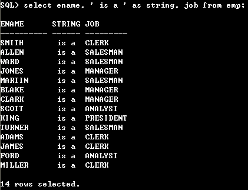

# 5. SELECT 문

## 어휘 단위

- 키워드 : 개별적인 SQL 요소 (예시 : DISTINCT)
- 절 : SQL의 한 부분 (예시 : SELECT DISTINCT)
- 문 : 2개 이상의 절이 결합된 문장 (예시 : SELECT DISTINCT deptno FROM emp;)

<br>

## 스키마 

테이블에 스키마를 지정하면 해당 스키마의 테이블을 조회할 수 있다.

|      SELECT deptno FROM dept;       | SELECT scott.dept.deptno<br />FROM scott.dept; |
| :---------------------------------: | :--------------------------------------------: |
|   SELECT deptno FROM scott.dept;    |                   위와 동일                    |
|    SELECT dept.deptno FROM dept;    |                   위와 동일                    |
| SELECT dept.deptno FROM scott.dept; |                   위와 동일                    |

현재 사용자가 SCOTT인 경우 좌측 쿼리는 우측 쿼리로 해석. 열은 테이블, 테이블은 스키마에 종속된 구조({스키마}, {테이블}, {열})다.

<br>

## SAMPLE 절

SAMPLE절을 사용하면 테이블을 샘플링하여 조회할 수 있다. 대용량 테이블에 대한 통계 값을 생성할 때 활용할 수 있다.

SAMPLE [BLOCK] (sample_percent) [SEED (seed_value)]

|       항목        |                             설명                             |
| :---------------: | :----------------------------------------------------------: |
|       BLOCK       |       블록 샘플링을 사용 (지정하지 않으면 로우 샘플링)       |
|  sample_percent   |        샘플링 비율 (0.000001 <= sample_percent < 100)        |
| SEED (seed_value) | 항상 동일한 샘플을 반환 (seed_value는 0~4294967295 범위의 정수) |

<br>

## 리터럴

리터럴은 변하지 않는 값이다. 다른 프로그래밍 언어의 상수와 유사하다. 문자, 숫자, 날짜, 인터벌 리터럴을 사용할 수 있다.



<br>

## DUAL 테이블

DUAL 테이블은 dummy 열로 구성되며, 1개의 행을 가지고 있다. DUAL 테이블은 리터럴 조회, 행 복제 등의 다양한 용도로 활용할 수 있다.

<br>

## 연결 연산자

피연산자를 연결한 문자 값을 반환, 문자 값이 아닌 피연산자는 문자 값으로 변환, 널은 무시

| 우선 순위 |                  연산자                   |
| :-------: | :---------------------------------------: |
|     1     |          단항 산술 연산자 (+, -)          |
|     2     |          다항 산술 연산자 (*, /)          |
|     3     | 다항 산술 연산자(+,-), 연결 연산자 (\|\|) |

<br>

## 단순 CASE 표현식

```sql
CASE expr
	{WHEN comparison_expr THEN return_expr}
	[ELSE else_expr]

```

- expr과 comparison_expr이 일치하는 첫 번째 return_expr, 일치하는 comparison_expr이 없다면 else_expr을 반환
- 단순 CASE 표현식은 expr과 comparison_expr의 데이터 타입이 동일하지 않으면 에러가 발생

<br>

## 검색 CASE 표현식

```sql
CASE
	{WHEN codition THEN return_expr}
	[ELSE else_expr]
END
```

- 검색 CASE 표현식은 codition이 TRUE인 첫 번째 return_expr를 반환한다. 없으면 else_expr 을 반환

<br>

## ROWID

데이터베이스에서 행을 식별할 수 있는 고유 값이다. 오브젝트, 파일, 블록, 행 번호의 조합으로 계산된다.

<br>

## 바인드 변수

``` sql
VAR v1 NUMBER; -- 바인드 변수 선언
EXXC : v1:= 1; -- 값 할당

SELECT :v1 AS c1 FROM DUAL;
```

바인드 변수를 사용하면 쿼리의 재사용성을 높일 수 있다.