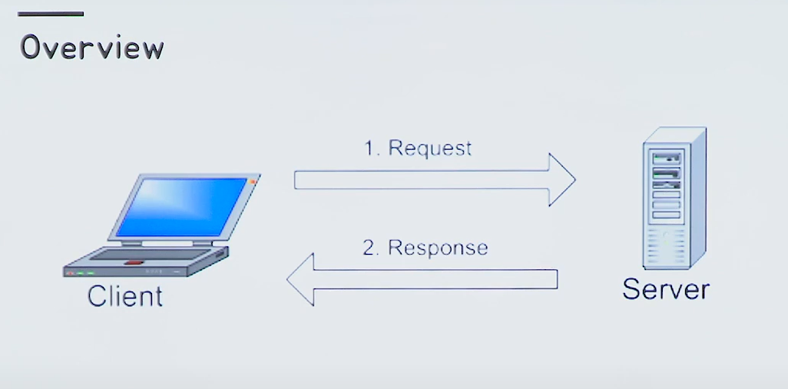
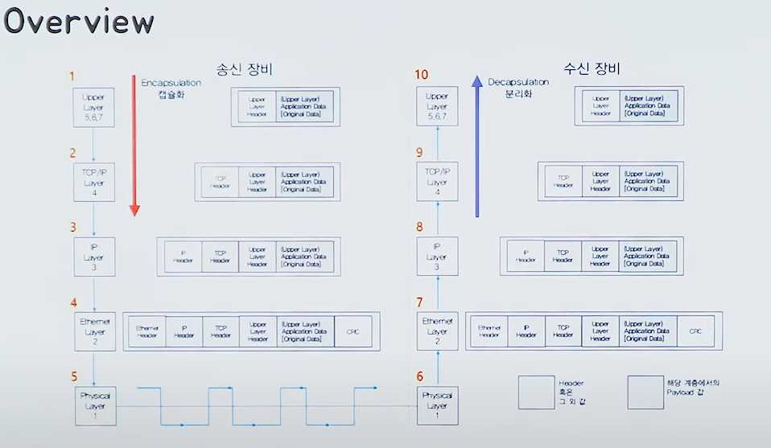

# [10분 테코톡] 👨‍🏫철시의 요청 응답 흐름 과정

## Overview

- 기본적인 요청 응답

 

## 내용

Browser

- 웹 서버에서 이동하며 **쌍방향으로 통신**하고 HTML 문서나 파일을 출력하는 그래픽 사용자 인터페이스 기반의 응용 소프트웨어다. 웹 브라우저는 대표적으로 HTTP 사용자 에이전트의 하나이기도 하다.

URL (웹서버에 '무엇을 요청할 것인가'를 정의한 내용!)

- http >> 프로토콜
- localhost >> 도메인
- 8080 >> 포트번호
- index.html >> 파일의 위치/ 요청 path
- ?key=value >> 쿼리스트링

요청 흐름 - method

|    method    |              meaning              |
| :----------: | :-------------------------------: |
|     GET      |             Read data             |
|     POST     |            Insert data            |
| PUT or PATCH | update data or insert if a new id |
|    DELETE    |            Delete data            |

- Http method는 URL로 특정한 자원을 어떻게 할 것인지 정의한다.
- Post 방식 message의 바디를 어떻게 해석해야하는지 추가 정보로 Content-type과 어느 정도의 길이 인지 알려주는 Content-Length가 있다.

 

## domain vs host

domain : 한 네트워크(서비스)를 대표하는 이름

host : 네트워크에서 고유하게 식별하는 기기(컴퓨터, 파일서버, 복사기, 모뎀 등)의 이름

ex) search.naver.com , cafe.naver.com , nid.naver.com

- seach, cafe, nid : 호스트 이름
- naver.com : 도메인 이름
- 두가지를 합쳐서 FQDN(Fully Qualified Domain Name)라고 한다.

 

## URI vs URL

- URI : 한 자원을 식별할 수 있는 식별자
- URI 의 구현방식 : URL, URN
- URL : 한 리소스에 대한 구체적인 위치 서술 (단점 : 리소스의 위치가 바뀌면 x)
- URN : 한 리소스에 대해 리소스의 위치에 영향을 받지 않는 이름