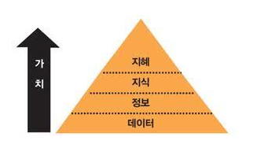
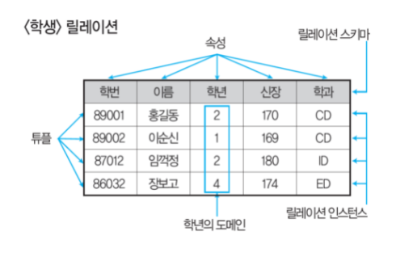
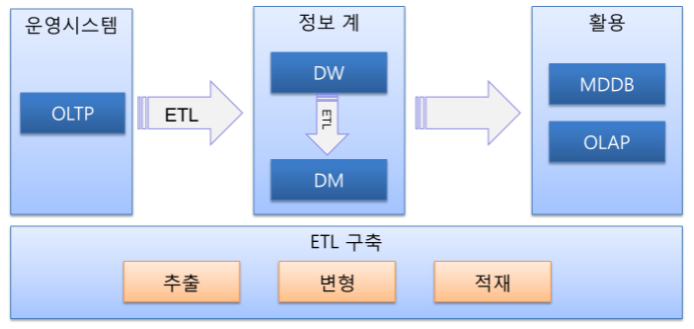
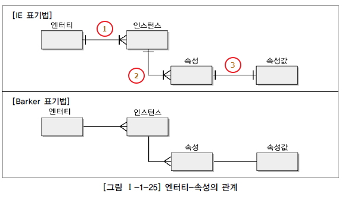
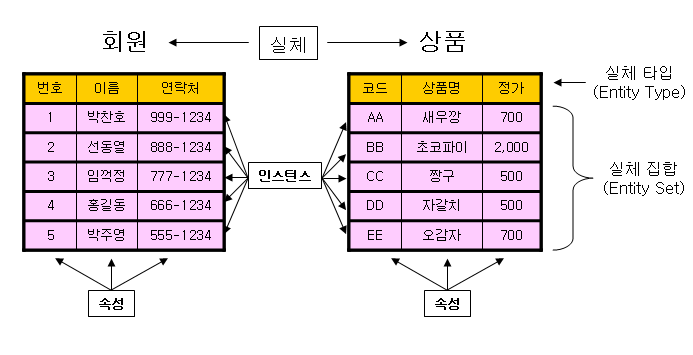
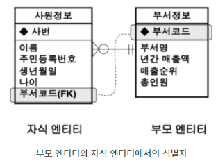
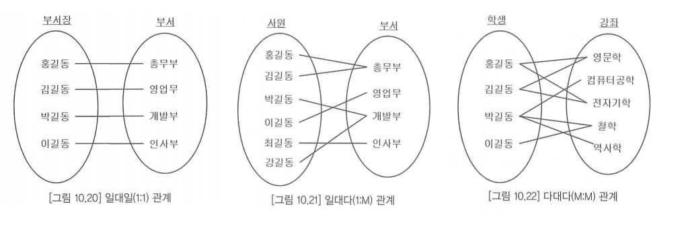
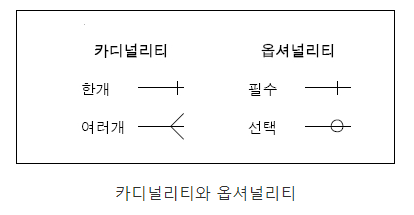
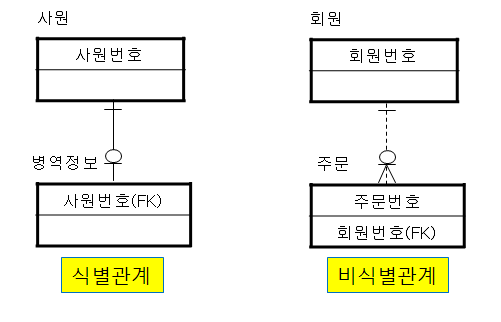

# 불친절한 SQL 프로그래밍 - (1부 기본 개념)

## 작성일 : 2021/09/02

### 데이터

1.1 데이터

- 정량적 데이터 : 숫자처럼 양으로 측정할 수 있는 데이터 (정형데이터)
- 정성적 데이터 : 텍스트나 이미지처럼 양으로 측정할 수 없는 데이터 (비정형 데이터)
   - sql은 정형 분석에 사용되는 프로그래밍 언어
   - 비정형 분석은 최근 빅 데이터라는 이름으로 비약적 발전을 이룸
   - 빅 데이터는 기존의 기술로 분석하기 어려웠던 대용량 정형 데이터와 분석 대상이 아니었던 비정형 데이터를 분석하기 위한 기술을 총칭
- 
- 데이터를 분석하여 정보를 해석함으로써 지식을 축적하고, 축적한 지식에서 지혜를 얻고, 지혜를 실천함으로써 새로운 데이터가 발생하는과정이 반복

1.2 데이터베이스

- 데이터 베이스 모델 : 계층형 모델, 네트워크형 모델, 관계형 모델 (관계형 모델을 주로 사용)
- 관계형 모델은 릴레이션에 데이터를 저장
- 
- 릴레이션은 튜플의 집합, 튜플은 속성의 집합
- NOSQL 데이터베이스는 관계형 데이터베이스보다 느슨한 일관성 모델을 채택한 데이터베이스로 빅 데이터와 실시간 웹 애플리케이션 영역에 널리 활용

1.3 데이터베이스 관리 시스템

- DBMS : 데이터베이스를 관리하기 위한 응용 프로그램
- EX) mySQL, ORACLE, PostgreSQL, SQLite 등등..

1.4 IT 시스템

- IT 시스템은 데이터의 발생 유형과 사용 목적에 따라 운영 시스템, EDW 영역, BI 영역으로 구분
- 
- 운영 시스템(Operational System) : 기업 운영에 필요한 데이터를 관리
- EDW(Enterprise Data Warehouse) : 분석을 위한 데이터를 저장
- BI (Business Intelligence) : 기업의 효율적인 의사 결정을 지원
- 각각의  시스템은 운영 목적이 다르므로 사용하는 SQL의 유형 또한 다름
   - OLTP 시스템은 응답 속도가 빠른 Top-N 쿼리, DW 시스템은 처리량이 많은 집계 쿼리의 비중이 높다
- OLTP (OnLine Transaction Processing) : 온라인 트랜잭션을 처리
- ODS (Operational Data Store) : 운영 데이터를 원본의 형태로 보관
- DW (Data Warehouse) : 운영 데이터를 통일된 형식으로 저장
- DM (Data Mart) : DW 데이터를 사용 목적에 따라 요약
- OLAP(OnLine Analytical Processing) : DM 데이터를 분석

### 데이터 모델링

2.1 데이터 모델

- 데이터 모델은 현실 세계를 데이터베이스로 구축할 수 있도록 추상화한 것
- 데이터베이스 모델과 데이터 모델은 상이한 개념
   - 데이터베이스 모델이 건축물 유형 (초가집, 통나무집, 벽돌집)
   - 데이터 모델은 건축물의 설계도
- 개념 데이터 모델, 논리 데이터 모델, 물리 데이터 모델로 구분
- 요구사항을 분석하여 개념 데이터 모델을 설계하고, 데이터 베이스 모델에 따라 개념 데이터 모델을 논리 데이터 모델로 상세화 한 후, DBMS에 따라 논리 데이터 모델을 물리 데이터 모델로 전환

2.2 E-R 모델

- 엔터티 타입은 인스턴스화된 엔터티의 집합

  - 객체 지향 설계에 비유하면 엔터티 타입은 클래스, 엔터티는 객체
  - 엔터티를 엔터티 타입의 인스턴스로 생각한다.

- 엔터티는 속성으로 구성

- 관계는 엔터티 간의 연관이고, 페어링의 집합, 페어링은 인스턴스 간의 연관

- 실무에서는 엔터티 타입을 엔터티, 엔터티를 인스턴스라고 부른다.

- 

  

- 2.2.1 엔터티

   - 엔터티는 개체로 인식할 수 있는 데이터의 집합
   - 엔터티는 사각형으로 표현
   - 2.2.1.1 기본 식별자
      - 엔터티에서 인스턴스를 고유하게 식별할 수 있는 속성
      - 반드시 기본 식별자를 가져야한다.
      - 단일 식별자 : 하나의 속성으로 구성된 식별자
      - 복합 식별자 : 2개 이상의 속성으로 구성된 식별자

- 2.2.2 속성

   - 속성은 엔터티에서 관리되는 데이터의 최소 단위
   - 속성은 분리되지 않아야 하며, 하나의 속성값만 가져야 한다.
   - 식별자가 아닌 속성은 아래쪽 사각형에 기술
   - 
   - 2.2.2.1 도메인
      - 도메인은 속성값의 범위
      - 물리 모델에서는 데이터 타입, 제약 조건으로 변환 
      - EX) VARCHAR2(1) 타입은 '길이가 한자리인 문자값', 'NOT NULL' 제약 조건은 '반드시 값이 존재함', CHECK 제약 조건은 'M이나 F만 입력됨'을 나타낸다.

- 2.2.3 관계

   - 관계는 엔터티 간의 업무적 연관

   - 하나의 엔터티는 하나 이상의 엔터티와 관계를 가질 수 있고, 관계를 가진 엔터티와 또 다른 관계를 가질 수 있다.

   - 자식 엔터티는 부모 엔터티의 기본 식별자를 상속받는다. 외래 식별자라고 한다.

   - 

   - 2.2.3.1 카디널리티

      - 하나의 부모 인스턴스가 몇 개의 자식 인스턴스와 페어링될 수 있는지를 나타낸다. (1:1,1:M,M:M)

      - 

      - 2.2.3.2 옵셔널리티

        - 부모 인스턴스와 자식 인스턴스의 페어링 여부를 나타낸다.
        - 페어링되어야 하면 필수 관계, 페어링되지 않아도 되면 선택 관계
        - 
        
        
     - 2.2.3.3 관계 유형
     
        - 식별관계 : 부모 엔터티의 기본 식별자가 자식 엔터티의 기본 식별자 속성으로 상속
     
        - 비식별 관계 : 일반 속성으로 상속
     
        - 
     
        - 식별 관계로만 설계한 데이터 모델
     
           - 자식 엔터티로 갈수록 기본 식별자가 길어진다. 기본 식별자가 길어지면 저장 공간도 늘어나고 SQL도 길어진다.
     
       - 비식별 관계로만 설계한 데이터 모델
     
         ​	- 자식 엔터티의 기본 식별자가 길어지지 않는다. 저장 공간을 최소화할 수 있지만 2단계를 넘어가면 관계가 단절되는 단점이 있다.